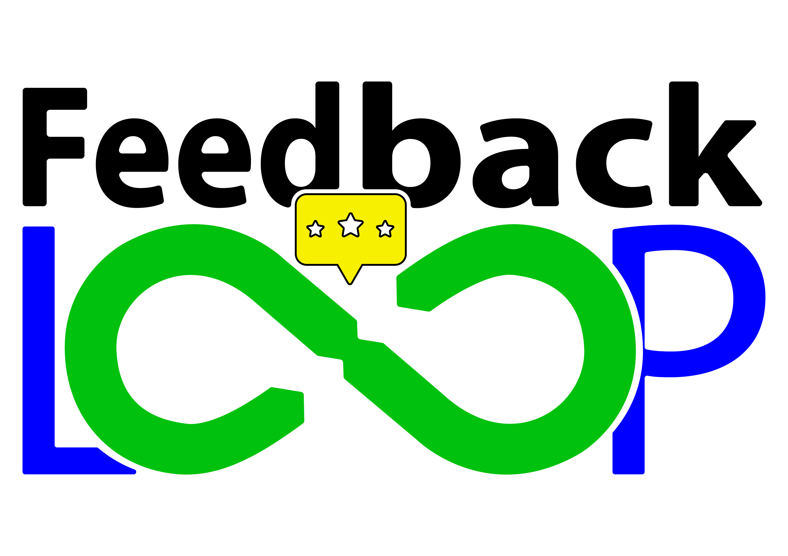

# *FeedbackLoop* - La meilleure plateforme de retours et de vote d'idées

<p align="center">
    
</p>

## Lancement du projet
- Placez vous à la racine du projet
- Taper la commande :
```bash
flutter run -d <appareil>
```
- Par exemple pour lancer en serveur web :
```bash
flutter run -d web-server
```

## Voulez-vous contribuer ?
Lisez attentivement tout le contenu du fichier ***CONTRIBUTING.md*** pour prendre connaissances des actions et des exigences du projet efin de contribuer efficament.